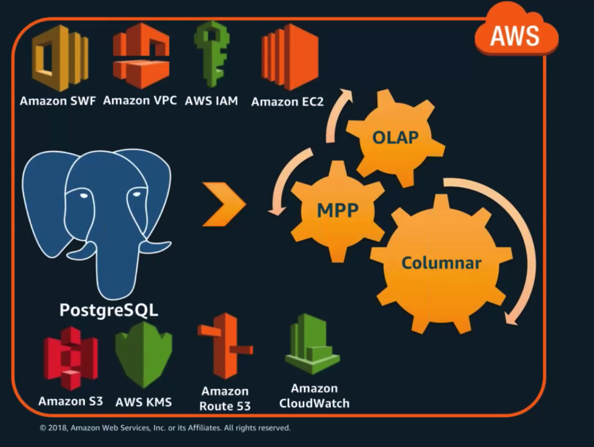
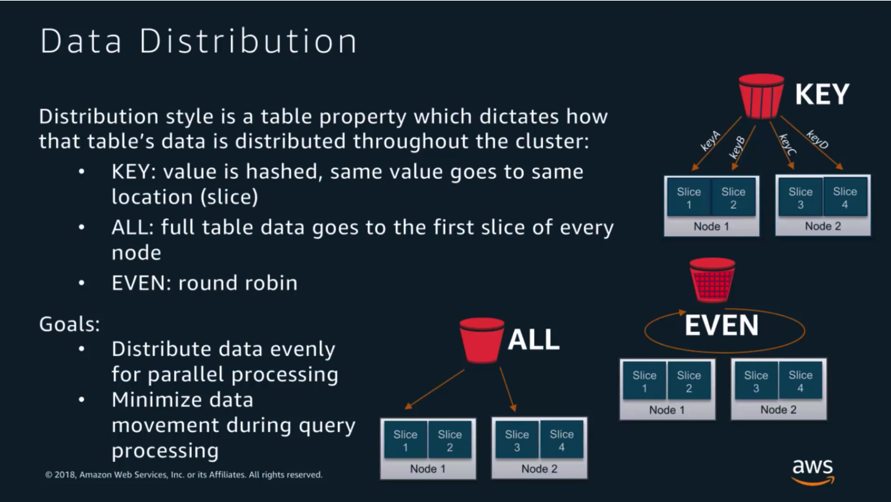
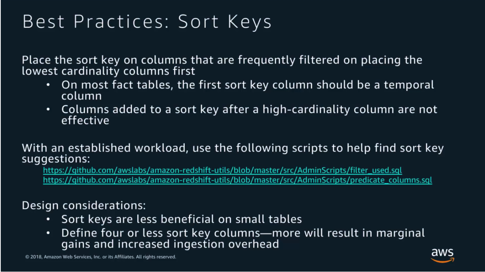

## **AWS Redshift Deep Dive**

**LastUpdate:** July 08, 2019

- **AWS Online Tech Talk**:
    - [link](https://www.youtube.com/watch?v=Hur-p3kGDTA)
    - Presenter: **Tony Gibbs**
    - Date: Aug 23, 2018

- **Content**:
    - Started as a fork of PostgreSQL, but was modified to a Columnar store  
    - Massive Parallel Processing **MPP**, scale horizontally up to 2PB of Raw storage
    - Support OnLine Analytical Processing **OLAP** Functions
    - Support the AWS Ecosystem 
    - Started in Feb 2013, patches usually every 2 weeks (within the 30 mins maintenance window)

- **Terminology and Concepts**:
    - Architecture: 
    - Compression:
        - Definition: 
        - Example: 
        - Best Practices: [Column Encoding Utility](https://github.com/awslabs/amazon-redshift-utils/tree/master/src/ColumnEncodingUtility)
    - Blocks:
        - Definition: 
    - Zone Maps:
        - Definition: 
    - Data Sorting:
        - Definition: 
        - Example by two sorting columns: 
        - Example with Zone Maps and Sorting: 
        - best practices:
            - [filter](https://github.com/awslabs/amazon-redshift-utils/blob/master/src/AdminScripts/filter_used.sql)
            - [predicate_columns](https://github.com/awslabs/amazon-redshift-utils/blob/master/src/AdminScripts/predicate_columns.sql)
    - Slices:
        - Definition: 
        - Data Distribution: 
            - Example ALL: 
            - Example EVEN: 
            - Example KEY **Wrong**: 
            - Example KEY **Good**: 
            - Best Practices: 
        - Summary: 
    - Disks:
        - Definition: 
    - Redundancy:
        - Definition: 
    - Transactions:
        - Definition: **ACID** (Atomicity, Consistency, Isolation, Durability)
        - [commit_statistics](https://github.com/awslabs/amazon-redshift-utils/blob/master/src/AdminScripts/commit_stats.sql)

**Data Ingestion**
- Considerations: 
- COPY Statement: 
    - Comparison: 
    - Best Practices: 
- Spectrum: 
- Deduplication / UPSERT: 
- Best practices: 

**ELT: Extract Transform Load**
- Concepts: [ETL/ELT](https://aws.amazon.com/mp/scenarios/bi/etl/) 
- Read the [paper](docs/etl_vs_elt_aws.pdf)
- Best Practices: 

**Vacuum and Analyse**
- Definition: 
- [vacuum_utility](https://github.com/awslabs/amazon-redshift-utils/tree/master/src/AnalyzeVacuumUtility)

**Work Load Management (WLM)**
- Definition: 
- Concepts: 
- Example Configuration: 
- Example: 
- Query Monitoring Rules QMR: 
- Best Practices: 
    - leave about 5% of non assigned memory, so each queue can do first serve
    - [wlm](https://github.com/awslabs/amazon-redshift-utils/blob/master/src/AdminScripts/wlm_apex_hourly.sql)

**Node Types**
- Dense Compute DC2: Solid State disks
- Dense Storage DS2: Magnetic disks
- **Note**: Using S3 as a tier storage coupled with Spectrum is considered like another type of storage
- Cluster Sizing: 

**Resources:**
- Blogs:
    - [Table Design](https://aws.amazon.com/blogs/big-data/amazon-redshift-engineerings-advanced-table-design-playbook-preamble-prerequisites-and-prioritization/)
    - [Tunning](https://aws.amazon.com/blogs/big-data/top-10-performance-tuning-techniques-for-amazon-redshift/)
    - [Spectrum](https://aws.amazon.com/blogs/big-data/10-best-practices-for-amazon-redshift-spectrum/)
    - [BigData Blog](https://aws.amazon.com/blogs/big-data/)
- Code:
    - [amazon-redshift-utils](https://github.com/awslabs/amazon-redshift-utils)
    - [aws-lambda-redshift-loader](https://github.com/awslabs/aws-lambda-redshift-loader)
    - [amazon-redshift-monitoring](https://github.com/awslabs/amazon-redshift-monitoring)
    - [aws-servicebroker-redshift](https://github.com/awslabs/aws-servicebroker-redshift)