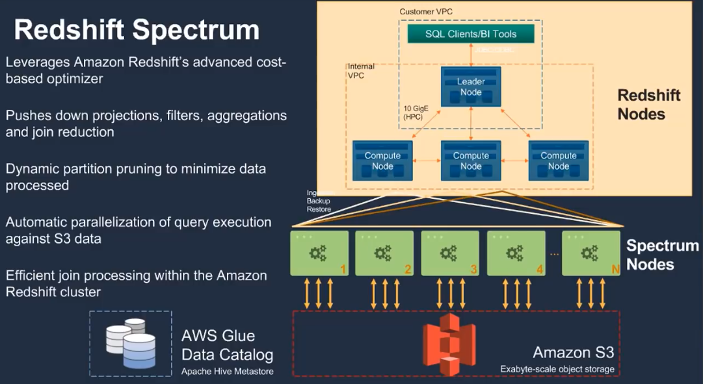
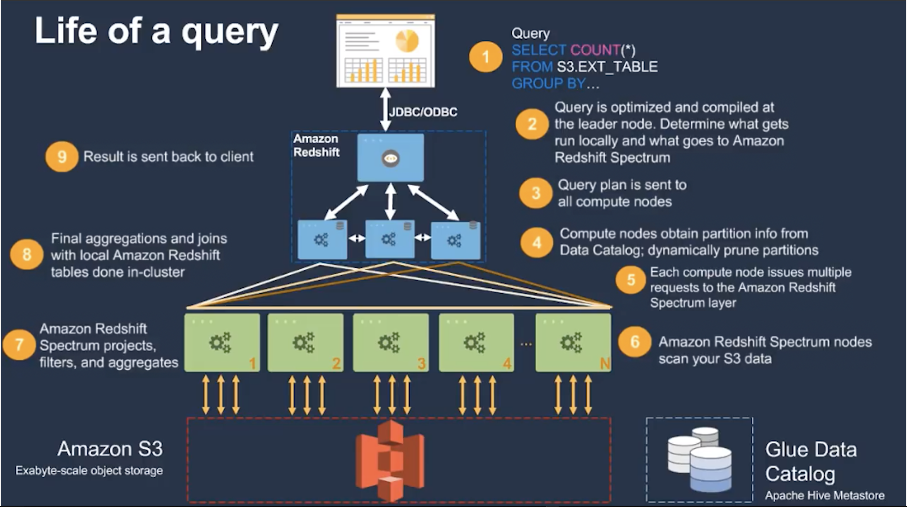
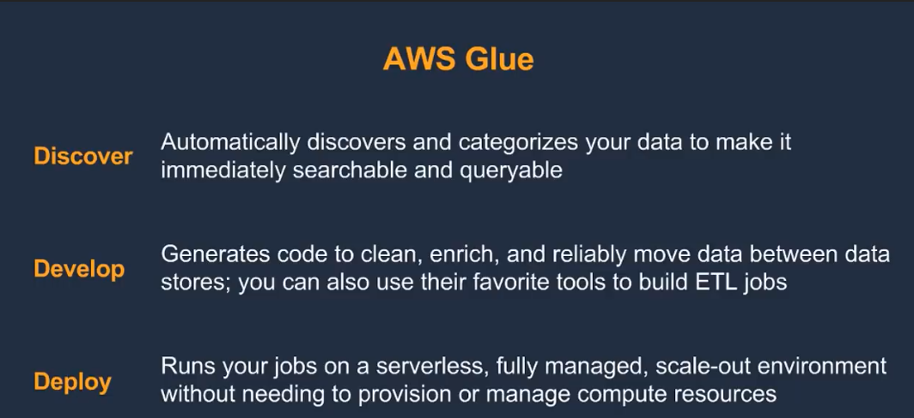
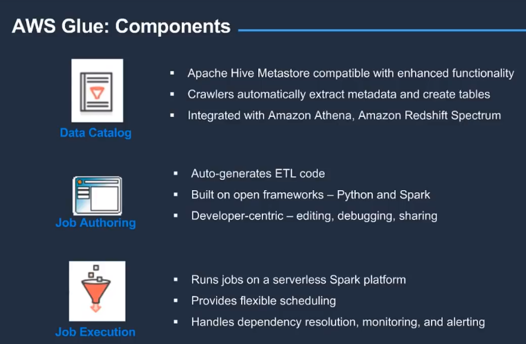
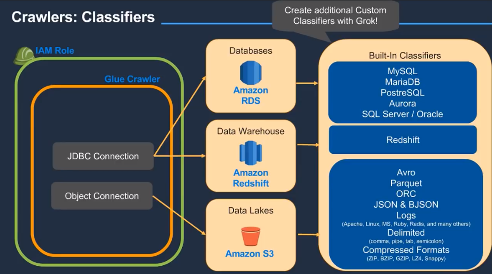
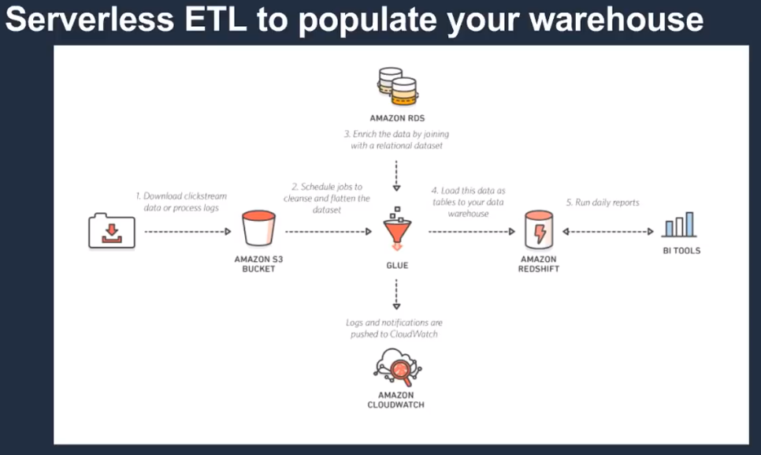
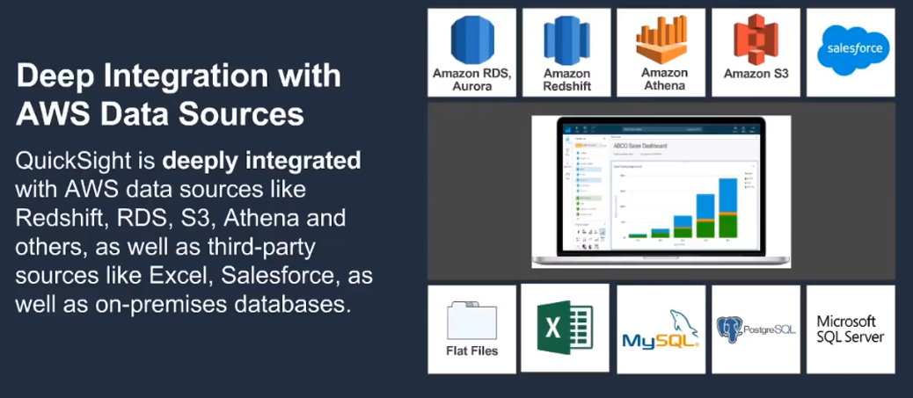
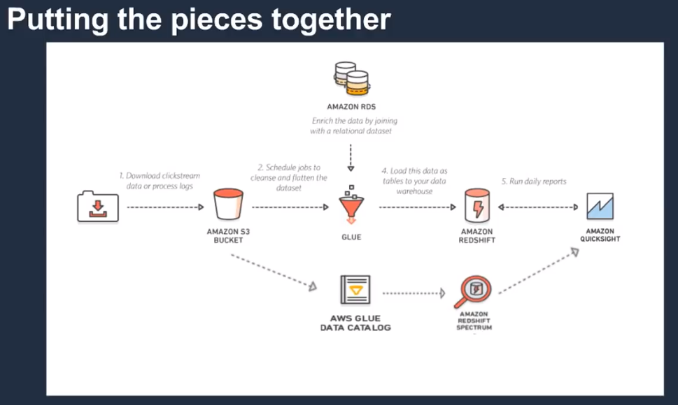

## **AWS Serverless Analytics**

- **AWS Online Tech Talk**:
    - [link](https://www.youtube.com/watch?v=fORJ6y572gs)
    - presenter: 
    - Date: Oct 13, 2017

- **Content**:
    - Redshift Spectrum: 
    - Life of a Query: 
    - Glue: 
        - Components: 
        - Crawlers: 
        - Data Catalog: 
        - ETL: 
    - QuickSight: 
        - Spice: 
    - All Pieces Together: 